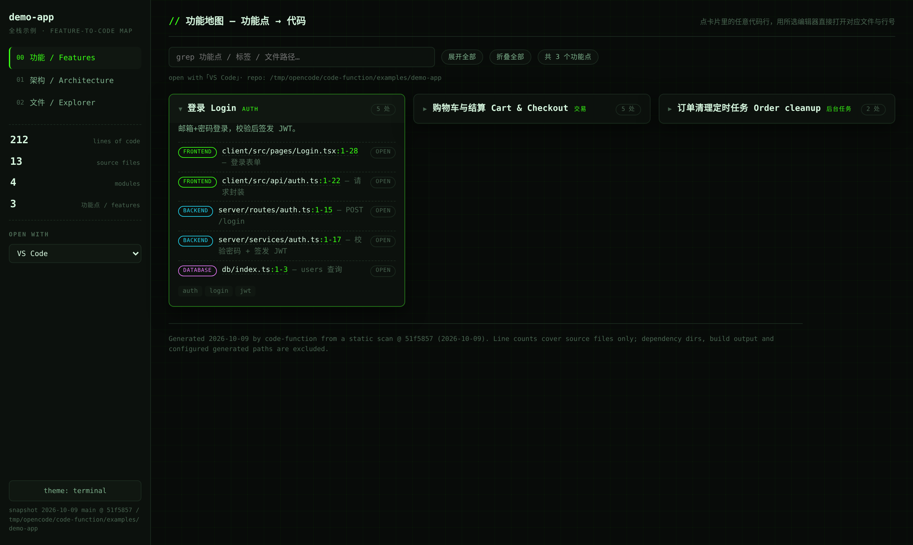
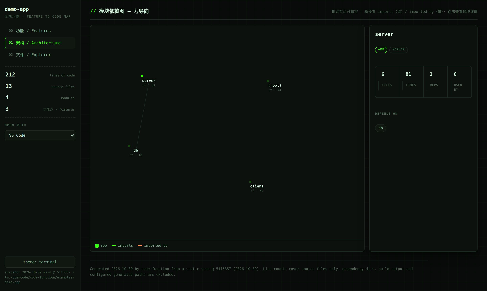
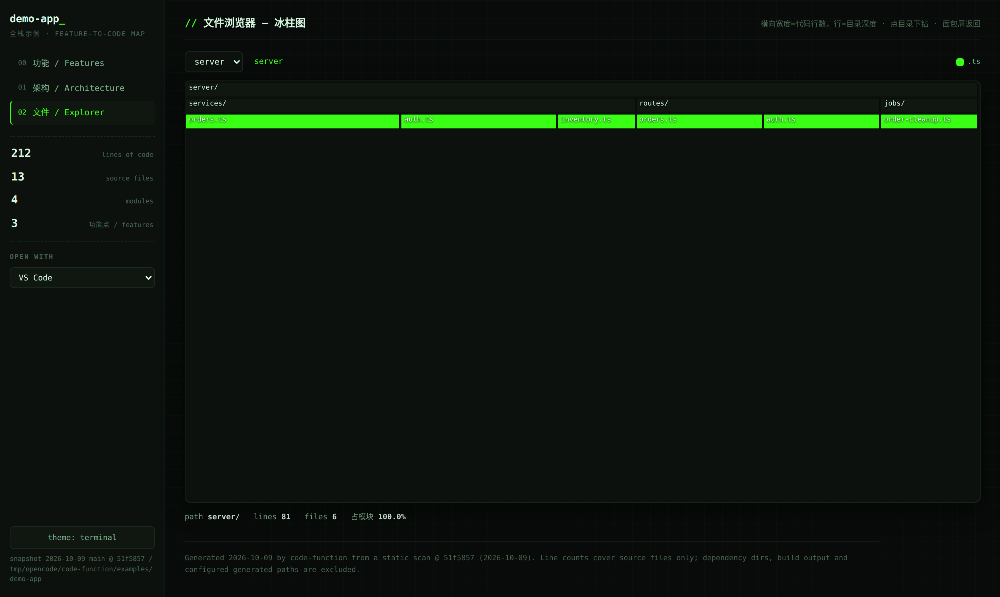

# code-function

[](LICENSE)
[](#)
[](https://linux.do)

> **Feature → code.** Turn any project into a **single, self-contained, offline HTML map** that
> lists every feature and, on click, shows the files implementing it across the whole stack —
> frontend, backend, database, workers — with **clickable `file:line` links that open in your editor.**

[中文说明](README.md) · An **Agent Skill** for opencode, Claude Code, Codex, Cursor, Gemini CLI, and
any agent supporting the [SKILL.md](https://opencode.ai/docs/skills) format.

## Why

An AI wrote a lot of code. Weeks later you want to change a feature ("login", "checkout") but have
to rediscover which page, which API route, which table, which worker it touches. Grep and directory
hopping is slow.

`code-function` gives you a map: **see the feature list, expand one, get the cross-stack line
numbers, click a line to open it in your editor.**

## Screenshots

### Features — feature → cross-stack code (collapsed by default, click to expand)



### Architecture — force-directed module dependency graph



### Explorer — lines-of-code icicle with directory drill-down



## How it works

```
repo ─► scripts/analyze.mjs ─► analysis-summary.json  (small; for the agent to read)
                    └► analysis.json                  (full; trimmed before embed)
config ─────────────┤
features.json ──────┼─► scripts/render.mjs ─► <name>-map.html   (self-contained, offline)
facets.json ────────┤
meta.json ──────────┘
```

`analyze.mjs` scans the repo once (~0.3s per 1k files); `render.mjs` merges the data into the
template and writes the HTML. Node.js 18+, **zero dependencies**. Large repos stay light
(a 16k-file project produces ~1.2 MB).

## Use

1. Drop this directory into your agent's skills folder, e.g.
   `~/.config/opencode/skills/code-function/` or `~/.claude/skills/code-function/`.
2. Ask your agent to run **code-function** on a repo, or run the scripts directly:

```bash
mkdir -p code-function-out
cat > code-function-out/map-config.json <<'EOF'
{ "repo": "/abs/path/to/repo", "title": "my-repo", "out": "my-repo-map.html" }
EOF

node scripts/analyze.mjs /abs/path/to/repo --out code-function-out/analysis.json
# author code-function-out/features.json (see references/features-schema.md)
node scripts/render.mjs code-function-out/map-config.json
```

Open `code-function-out/my-repo-map.html` in a browser. A runnable example lives in
[`examples/`](examples/) — `node scripts/render.mjs examples/map-config.json`.

## Output

- **Features** — feature → cross-stack code cards. Collapsed by default; click a card to expand,
  then click any code line to open it in your editor (VS Code, Cursor, Windsurf, Trae, JetBrains,
  Sublime, or the OS default).
- **Architecture** — force-directed module graph; drag nodes, hover to trace imports / imported-by.
- **Explorer** — lines-of-code icicle; click directories to drill down.
- **Facet tabs** — optional stack-specific pages declared in `facets.json`.

## Notes

- Click-to-open relies on the `repo` path in `map-config.json`; moving the repo requires re-rendering.
- `features.json` line numbers are a snapshot and drift as code changes.

## Recognition

This project recognizes and thanks the [LINUX DO](https://linux.do) community. “Where possible begins.”

## License

MIT © 2026 lyp1278471473. Fully open source, no closed parts. See [LICENSE](LICENSE).
